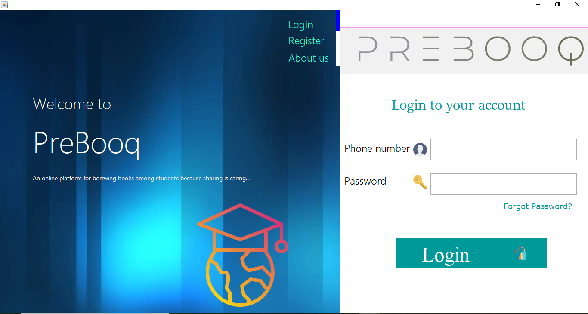
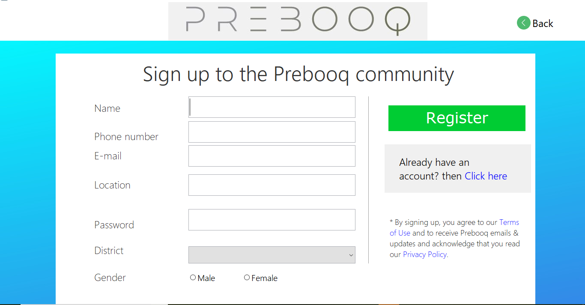
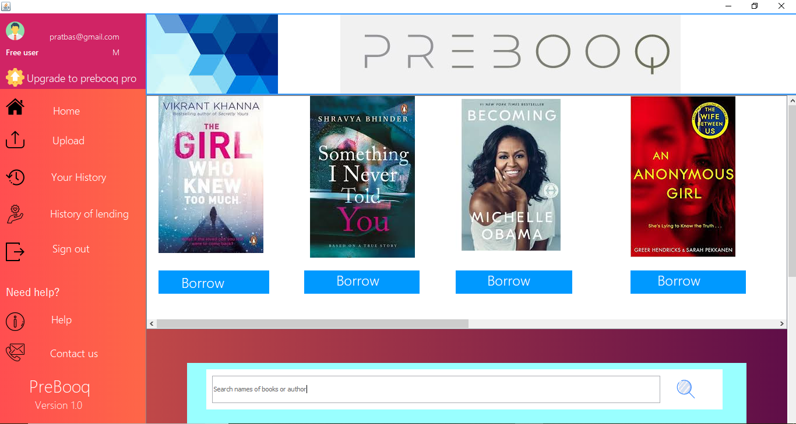
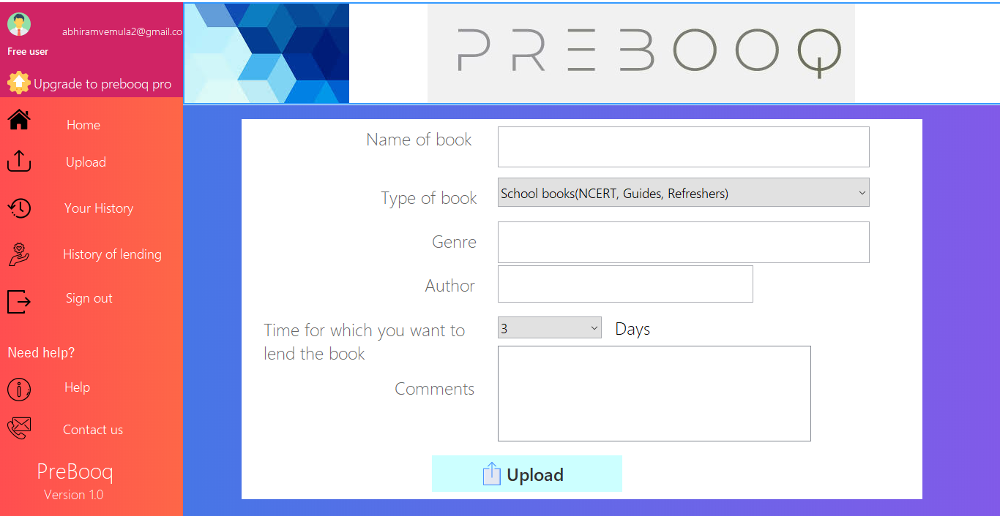
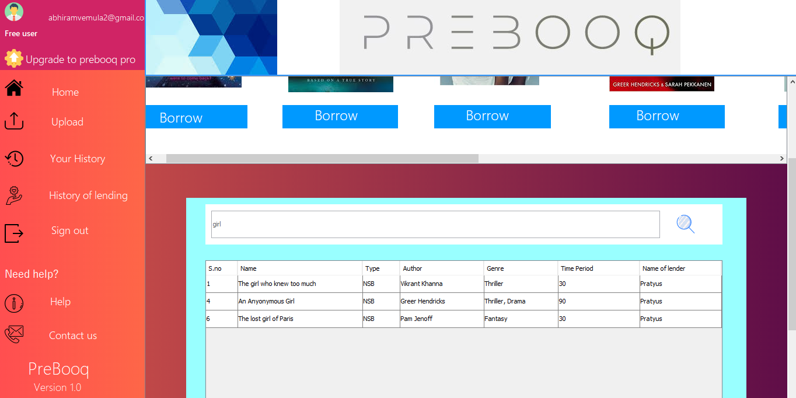
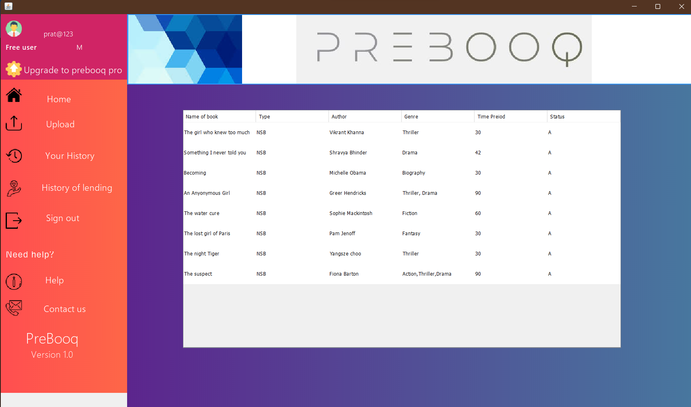
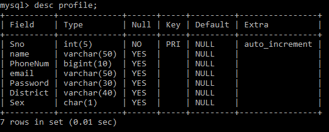
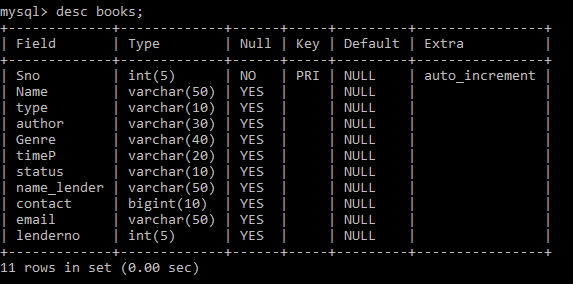
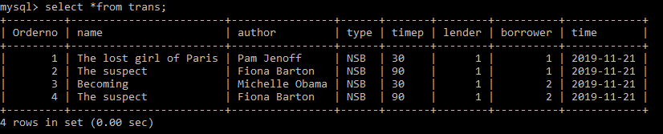
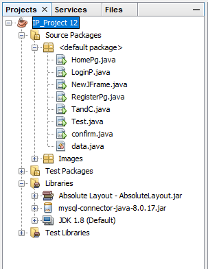

# Prebooq
**Introducing "Prebooq" - Empowering Students to Borrow, Connect, and Contribute to a Sustainable Future**

Students looking for an innovative way to save money, expand their reading horizons, and connect with like-minded peers? **Prebooq** - a cutting-edge Java-based app designed specifically for students, by students. Embracing a greener and more connected academic journey, as they explore an extensive array of academic and non-academic books and novels, build valuable connections, and contribute to a sustainable environment.

## **Features and Benefits:**

**1. Book Borrowing Platform:**
Prebooq revolutionizes the way students access books by providing a convenient platform for borrowing books from their seniors. No more stressing about purchasing costly textbooks or novels that may only be needed for a limited time. With Prebooq, you can easily borrow books from fellow students who have already completed the courses or enjoyed captivating novels.

**2. Save Money:**
We understand the financial constraints that students face. By utilizing Prebooq, you can significantly reduce the burden of purchasing new books and save your hard-earned money for other essential expenses. This mutual sharing system promotes a culture of cooperation and academic support, helping each other grow without financial strain.

**3. Environmentally Conscious:**
Join the growing movement towards sustainability and environmental responsibility. By borrowing books instead of buying new ones, you directly contribute to reducing paper waste and the overall carbon footprint. Each time you borrow and share a book, you play an active role in conserving the environment for future generations.

**4. Meaningful Connections:**
Expand your social circle and make lasting connections with students who share similar interests. Prebooq fosters a sense of community among its users, enabling book lovers to connect, discuss, and share recommendations. Forge friendships beyond academics and explore diverse perspectives through literature.

**5. User-Friendly Interface:**
Navigating through Prebooq is a breeze with its intuitive user interface. Our app ensures a seamless and enjoyable experience, making it easy to search for books, request borrowing, and communicate with fellow students.

# Overview
* FrontEnd - Java on Netbeans
* Backend - MySQL
> [!IMPORTANT]
> 
> This app was made using ***Java Swing Framework***  and a local *MySQL* DB
> 
> The required JAR Files can be found [here](dist/lib)
> 
> The Distributable build can be found under dist as [Prebooq.jar](dist)  and needs a Java(TM) SE Runtime Environment (build 14.0.1+7) or above running on the machine
>
 
## Demo
- ## [Sign-in Page](src/LoginP.java)

- ## [Registration Page](src/RegisterPg.java)

- ## [Home Page](src/HomePg.java)

  - ### Upload Tab

  - ### Search Tab

  - ### History Tab

## Database Schema
> [!NOTE]
> Use the [SQL Commands](Sql_commands), copy and paste them to create the DB and related tables and queries

* Table- Profile
  

* Table- Book
  

* Table- Transaction

## Form Structure

